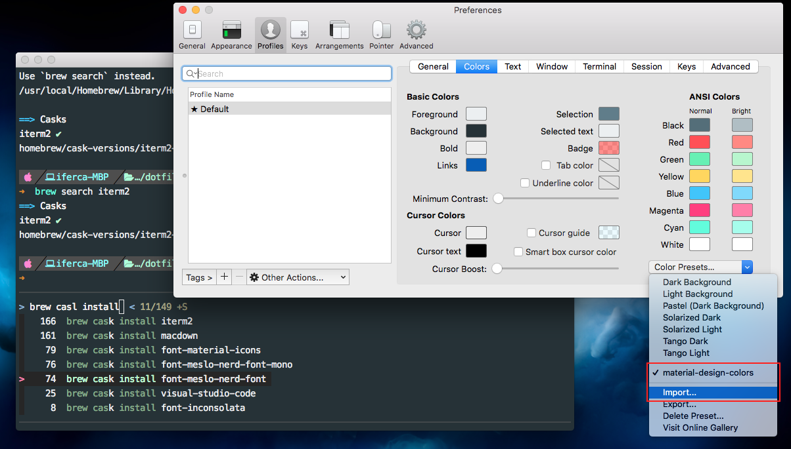
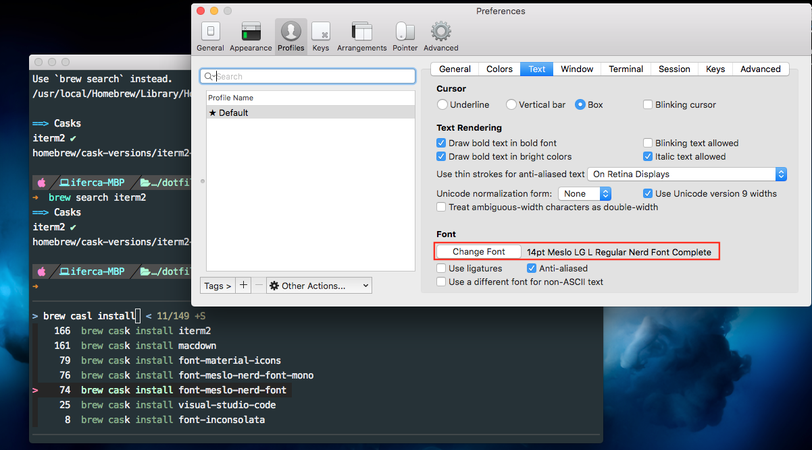
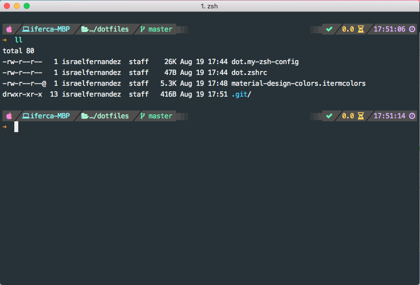

# Base files and instrictions to setup a new OSX system

This repository can be used to setup a new MacOS system.

* Instal [homebrew](https://brew.sh/):

```
$ /usr/bin/ruby -e "$(curl -fsSL https://raw.githubusercontent.com/Homebrew/install/master/install)"
```

Homebrew and next steps will require git & XCode Command line tools, in case somethig is missing eecute:

```
$ xcode-select --install
```

* Install the awesome [oh my zsh](https://ohmyz.sh/):

```
#Via curl:
$ sh -c "$(curl -fsSL https://raw.github.com/robbyrussell/oh-my-zsh/master/tools/install.sh)"

#Via wget:
$ sh -c "$(wget https://raw.github.com/robbyrussell/oh-my-zsh/master/tools/install.sh -O -)"
```

* Clone this repository or download zip file offered by github

* Copy dot.* files from this repo to your home removing the starting 'dot' out of them

```
$ cp dot.my-zsh-config ~/.my-zsh-config
$ cp dot.zshrc ~/.zshrc
```
* Install iterm2:

```
$ brew cask install iterm2
``` 
* Install Meslo nerd font:

```
$ brew tap homebrew/cask-fonts
$ brew cask install font-hack-nerd-font
```
* Import `material-design-colors.itermcolors` from this repo into iTerm2 colotr scheme tab and select it as shown next:



* Select font as shown next:



Final result should look like this: 



Credits for original version goes to: [tonylambiris/dotfiles
](https://github.com/tonylambiris/dotfiles)
